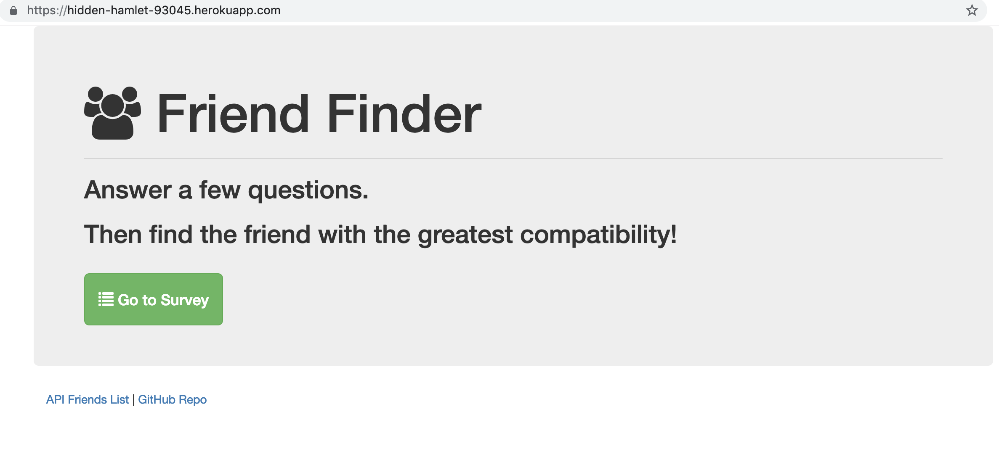
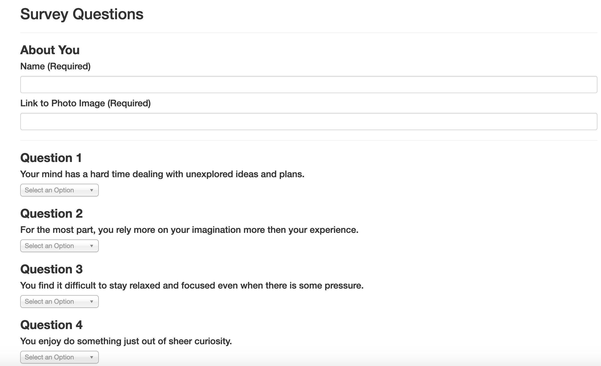
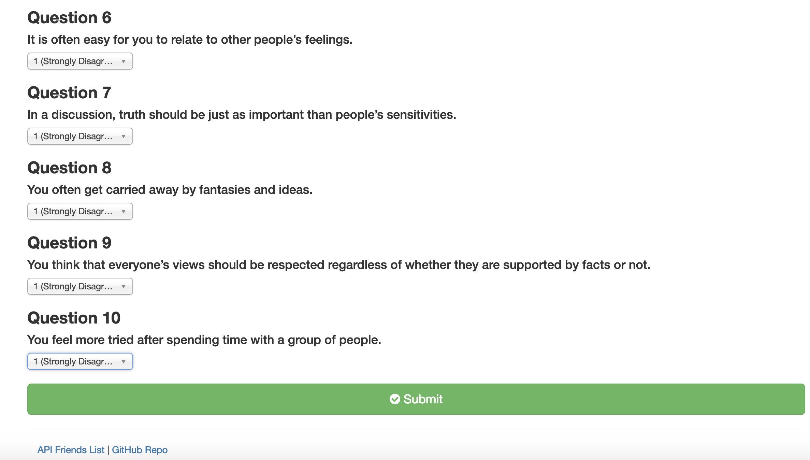

# FriendFinder
Node and Express Servers application. 

## Table of contents

* [About this project](#about-this-project)
* [Project requirements](#project-requirements)
* [Structure of the project](#structure-of-the-project)
* [Screenshots](#screenshots)
* [Technologies used to create app](#technologies-used)
* [How to use app](#how-to-use)

##  About this project
This project is an compatiblity-based "FriendFinder" application. Basically a friend compatibity app. This full-stack site takes in results from users surveys, then compare their answers with those from other users. The app then displays the name and picture of the user with the best overall match. 

##  Project requirements

<li>1. Your survey should have 10 questions of your choosing. Each answer should be on a scale of 1 to 5 based on how much the user agrees or disagrees with a question.</li>

<li>2. Your `server.js` file should require the basic npm packages we've used in class: `express` and `path`.</li>

<li>3. Your `htmlRoutes.js` file should include two routes:

   * A GET Route to `/survey` which should display the survey page.
   * A default, catch-all route that leads to `home.html` which displays the home page.</li>

<li>4. Your `apiRoutes.js` file should contain two routes:

   * A GET route with the url `/api/friends`. This will be used to display a JSON of all possible friends.
   * A POST routes `/api/friends`. This will be used to handle incoming survey results. This route will also be used to handle the compatibility logic.</li>

<li>5. You should save your application's data inside of `app/data/friends.js` as an array of objects.</li>

<li>6. Determine the user's most compatible friend using the following as a guide:

   * Convert each user's results into a simple array of numbers (ex: `[5, 1, 4, 4, 5, 1, 2, 5, 4, 1]`).
   * With that done, compare the difference between current user's scores against those from other users, question by question.
    Add up the differences to calculate the `totalDifference`.
   * Remember to use the absolute value of the differences. Put another way: no negative solutions! Your app should calculate both `5-3` and `3-5` as `2`, and so on.
   * The closest match will be the user with the least amount of difference.</li>

<li>7. Once you've found the current user's most compatible friend, display the result as a modal pop-up.
   * The modal should display both the name and picture of the closest match.</li>

##  Structure of the project
<li>README.md</li>
<li>gitignore</li>
<li>app</li>
    <li>* data</li>
        <li>* friends.js</li>
    <li>* public</li>
        <li>* home.html</li>
        <li>* survey.html</li>
    <li>* routing</li>
        <li>* apiRoutes.js</li>
        <li>* htmlRoutes.js</li>
    <li>node_modules</li>  
    <li>package.json</li>
    <li>server.js</li>

##  Screenshots
Images of Friend Finder-app

##  Technologies used to create the app
<li>Heroku</li>
<li>Node.js</li>
<li>Command-line</li>
<li>Javascript</li>
<li>package-json</li>
<li>node_modules</li>

##  How to use app
<li>Navigate to the href="https://hidden-hamlet-93045.herokuapp.com".</li>
<li>In the command-line input 'node bamazonCustomer.js' press enter.</li>
<li>Once the Welcome to Bamazon, displays the products and inventory.</li>
<li>The "What is the ID number of the product that you would like to buy (enter a number from 1 to 10).</li>
<li>The customer then selects the "ID" number desired.</li>
<li>If the quanity is suffienct, the customer will be notified that "You're allowed to buy that many!", The total cost of the purchase.</li>
<li>The inventory is then updated.</li>

